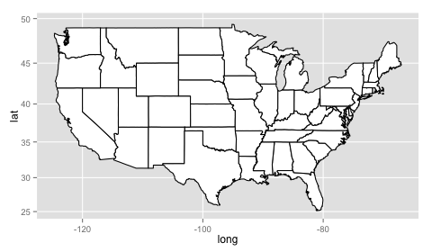
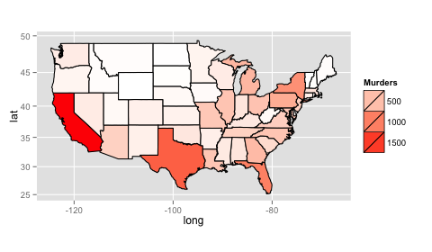
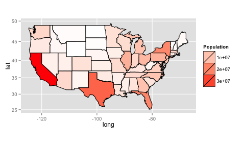
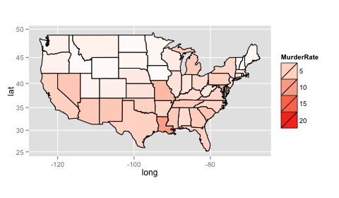
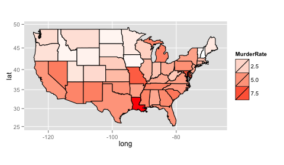
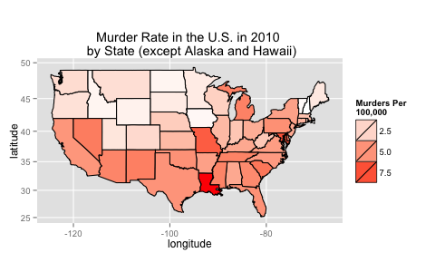
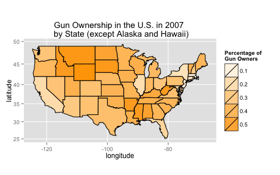
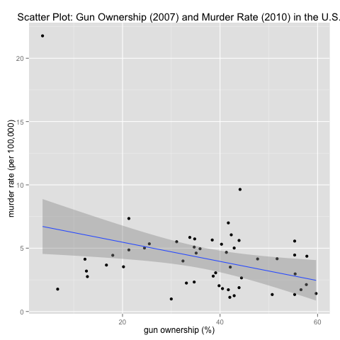
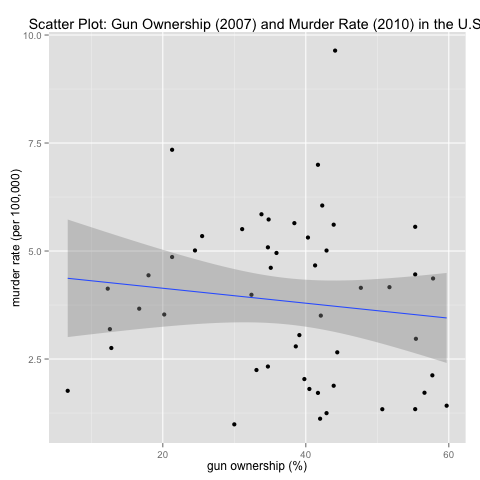

<h1>Guns, Murders, States</h1>

<h2>Objective</h2>
Visualize gun ownership and murder rates in the United States.

<h2>About the Data</h2>
This data is provided by the U.S. Census Bureau and the FBI, and is decribed <a href='http://en.wikipedia.org/wiki/Gun_violence_in_the_United_States_by_state' target='_blank'>here</a>.

<h2>Visualization Process</h2>
<h5>Plot a map of the U.S.</h5>

    > library(ggplot2)  # for map_data() function
    > statesMap <- map_data('state')
    > head(statesMap)
	   long      lat group order  region subregion
    1 -87.46201 30.38968     1     1 alabama      <NA>
    2 -87.48493 30.37249     1     2 alabama      <NA>
    3 -87.52503 30.37249     1     3 alabama      <NA>
    4 -87.53076 30.33239     1     4 alabama      <NA>
    5 -87.57087 30.32665     1     5 alabama      <NA>
    6 -87.58806 30.32665     1     6 alabama      <NA>
    >
    > ggplot(statesMap, aes(x = long, y = lat, group = group)) +
    +   geom_polygon(fill = 'white', color = 'black') +
    +   coord_map('mercator')

<h5>Load and view gun ownership and murders data</h5>
    > murders <- read.csv('./data/murders.csv')
    > head(murders)
	   State Population PopulationDensity Murders GunMurders GunOwnership
    1    Alabama    4779736            94.650     199        135        0.517
    2     Alaska     710231             1.264      31         19        0.578
    3    Arizona    6392017            57.050     352        232        0.311
    4   Arkansas    2915918            56.430     130         93        0.553
    5 California   37253956           244.200    1811       1257        0.213
    6   Colorado    5029196            49.330     117         65        0.347

<h5>Merge 'stateMap' and 'murders' data frames</h5>
<h6>Examine data frames to merge</h6>
    > str(statesMap)
    'data.frame':	15537 obs. of  6 variables:
     $ long     : num  -87.5 -87.5 -87.5 -87.5 -87.6 ...
     $ lat      : num  30.4 30.4 30.4 30.3 30.3 ...
     $ group    : num  1 1 1 1 1 1 1 1 1 1 ...
     $ order    : int  1 2 3 4 5 6 7 8 9 10 ...
     $ region   : chr  "alabama" "alabama" "alabama" "alabama" ...
     $ subregion: chr  NA NA NA NA ...
    > str(murders)
    'data.frame':	51 obs. of  6 variables:
     $ State            : Factor w/ 51 levels "Alabama","Alaska",..: 1 2 3 4 5 6 7 8 9 10 ...
     $ Population       : int  4779736 710231 6392017 2915918 37253956 5029196 3574097 897934 601723 19687653 ...
     $ PopulationDensity: num  94.65 1.26 57.05 56.43 244.2 ...
     $ Murders          : int  199 31 352 130 1811 117 131 48 131 987 ...
     $ GunMurders       : int  135 19 232 93 1257 65 97 38 99 669 ...
     $ GunOwnership     : num  0.517 0.578 0.311 0.553 0.213 0.347 0.167 0.255 0.036 0.245 ...

<h6>Create a new variable for merge key</h6>
    > murders$region <- tolower(murders$State)

<h6>Merge data frames</h6>
    > data <- merge(statesMap, murders, by = 'region')
    > head(data)
       region      long      lat group order subregion Population PopulationDensity Murders GunMurders GunOwnership
    1 alabama -87.46201 30.38968     1     1      <NA>    4779736             94.65     199        135        0.517
    2 alabama -87.48493 30.37249     1     2      <NA>    4779736             94.65     199        135        0.517
    3 alabama -87.52503 30.37249     1     3      <NA>    4779736             94.65     199        135        0.517
    4 alabama -87.53076 30.33239     1     4      <NA>    4779736             94.65     199        135        0.517
    5 alabama -87.57087 30.32665     1     5      <NA>    4779736             94.65     199        135        0.517
    6 alabama -87.58806 30.32665     1     6      <NA>    4779736             94.65     199        135        0.517

<h6>Check for a successful merge and consistency</h6>
    > unique(data$region == tolower(data$State))
    [1] TRUE

<h6>Remove unnecessary (duplicate) column</h6>
    > data <- subset(data, select = - State)

<h5>Plot a map of murders</h5>

    > ggplot(data, aes(x = long, y = lat, group = group, fill = Murders)) + 
    +   geom_polygon(color = 'black') +
    +   scale_fill_gradient(low = 'white', high = 'red', guide = 'legend')

<h5>Plot a map of population</h5>

    > ggplot(data, aes(x = long, y = lat, group = group, fill = Population)) +
    +   geom_polygon(color = 'black') + 
    +   scale_fill_gradient(low = 'white', high = 'red', guide = 'legend')

<h5>Plot a map of murder rates</h5>

    > data$MurderRate <- data$Murders / data$Population * 100000  # number of murders per 100000 residents
    > ggplot(data, aes(x = long, y = lat, group = group, fill = MurderRate)) +
    +   geom_polygon(color = 'black') +
    +   scale_fill_gradient(low = 'white', high = 'red', guide = 'legend')

<h5>Region (or state) with the highest/lowest murder rate</h5>

    > range(data$MurderRate)
    [1]  0.9874893 21.7708148
    > rMurder <- sort(unique(data$MurderRate))
    > rMurder
     [1]  0.9874893  1.1186737  1.2473924  1.3381089  1.3396428  1.4193809  1.7157105  1.7195215  1.8067378  1.8814097
    [11]  2.0359826  2.1224663  2.2455068  2.3264156  2.6551850  2.7551690  2.7924687  2.9681694  3.0537638  3.1919951
    [21]  3.5049374  3.5306133  3.6652615  3.9873431  4.1288032  4.1480704  4.1634099  4.4379991  4.4582872  4.6119097
    [31]  4.6667799  4.8612287  4.9551489  5.0115278  5.0132944  5.0856615  5.3125000  5.3456045  5.5068690  5.5606163
    [41]  5.6097401  5.6456933  5.7304392  5.8506579  6.0535776  6.9962449  7.3438327  9.6396237 21.7708148

<h6>Save murder rates in a column of 'murders' data frame</h6>
    > murders$MurderRate <- murders$Murder / murders$Population * 100000

<h6>Region with the highest murder rate</h6>
    > as.character(murders[murders$MurderRate == max(rMurder), ]$State)
    [1] "District of Columbia"

<h6>Region with the lowest murder rate</h6>
    > as.character(murders[murders$MurderRate == min(rMurder), ]$State)
    [1] "New Hampshire"

<h5>Plot a map or murder rates excluding D.C. (outlier)</h5>

    > ggplot(subset(data, region != 'district of columbia'), 
    +        aes(x = long, y = lat, group = group, fill = MurderRate)) +
    +   geom_polygon(color = 'black') +
    +   scale_fill_gradient(low = 'white', high = 'red', guide = 'legend') + 
    +   coord_map('mercator')

<h5>Final map of murder rates</h5>

    > ggplot(subset(data, region != 'district of columbia'), 
    +        aes(x = long, y = lat, group = group, fill = MurderRate)) +
    +   geom_polygon(color = 'black') +
    +   scale_fill_gradient(low = 'white', high = 'red', guide = 'legend') +
    +   xlab('longitude') + 
    +   ylab('latitude') +
    +   ggtitle('Murder Rate in the U.S. in 2010 \n by State (except Alaska and Hawaii)') + 
    +   guides(fill = guide_legend(title = 'Murders Per \n100,000')) +
    +   coord_map('mercator')

<h5>Plot a map of gun ownership</h5>

    > ggplot(data, aes(x = long, y = lat, group = group, fill = GunOwnership)) + 
    +   geom_polygon(color = 'black') + 
    +   scale_fill_gradient(low = 'white', high = 'orange', guide = 'legend') +
    +   xlab('longitude') + 
    +   ylab('latitude') + 
    +   ggtitle('Gun Ownership in the U.S. in 2007 \n by State (except Alaska and Hawaii)') +
    +   guides(fill = guide_legend(title = 'Percentage of \nGun Owners')) +  
    +   coord_map('mercator')

<h5>Region (or state) where gun ownership is most and least prevalent</h5>

    > murders[order(-murders$GunOwnership), c(1, 6)]
		      State GunOwnership
    51              Wyoming        0.597
    2                Alaska        0.578
    27              Montana        0.577
    42         South Dakota        0.566
    49        West Virginia        0.554
    4              Arkansas        0.553
    13                Idaho        0.553
    25          Mississippi        0.553
    1               Alabama        0.517
    35         North Dakota        0.507
    18             Kentucky        0.477
    50            Wisconsin        0.444
    19            Louisiana        0.441
    43            Tennessee        0.439
    45                 Utah        0.439
    16                 Iowa        0.429
    37             Oklahoma        0.429
    41       South Carolina        0.423
    17               Kansas        0.421
    46              Vermont        0.420
    24            Minnesota        0.417
    26             Missouri        0.417
    34       North Carolina        0.413
    20                Maine        0.405
    11              Georgia        0.403
    38               Oregon        0.398
    15              Indiana        0.391
    28             Nebraska        0.386
    23             Michigan        0.384
    44                Texas        0.359
    47             Virginia        0.351
    32           New Mexico        0.348
    6              Colorado        0.347
    39         Pennsylvania        0.347
    29               Nevada        0.338
    48           Washington        0.331
    36                 Ohio        0.324
    3               Arizona        0.311
    30        New Hampshire        0.300
    8              Delaware        0.255
    10              Florida        0.245
    5            California        0.213
    21             Maryland        0.213
    14             Illinois        0.202
    33             New York        0.180
    7           Connecticut        0.167
    40         Rhode Island        0.128
    22        Massachusetts        0.126
    31           New Jersey        0.123
    12               Hawaii        0.067
    9  District of Columbia        0.036

<h5>Murder rate vs. gun ownership</h5>

<h6>Correlation coefficient and its p-value</h6>
    > cor.test(murders$GunOwnership, murders$MurderRate)$estimate  # correlation coefficient
	  cor 
    -0.341224 
    >
    > cor.test(murders$GunOwnership, murders$MurderRate)$p.value  # p-value
    [1] 0.0142676

<h6>R^2 of the linear model</h6>
    > lm1 <- lm(MurderRate ~ GunOwnership, data = murders)
    > round(summary(lm1)$r.squared, 3)
    [1] 0.116

<h6>Plot murder rate vs. gun ownership</h6>

    > ggplot(murders, aes(x = GunOwnership * 100, y = MurderRate)) + 
    +   geom_point() +
    +   stat_smooth(method = 'lm') + 
    +   xlab('gun ownership (%)') + 
    +   ylab('murder rate (per 100,000)') + 
    +   ggtitle('Scatter Plot: Gun Ownership (2007) and Murder Rate (2010) in the U.S.')

<h5>Murder rate vs. gun ownership (outlier removed)</h5>
<h6>Create a new data frame with removed outlier (D.C.)</h6>
    > murders2 <- subset(murders, State != 'District of Columbia')

<h6>Correlation coefficient and its p-value</h6>
    > cor.test(murders2$GunOwnership, murders2$MurderRate)$estimate
	   cor 
    -0.1232281 
    > cor.test(murders2$GunOwnership, murders2$MurderRate)$p.value
    [1] 0.3938971

<h6>R^2 of the linear model</h6>
    > lm2 <- lm(MurderRate ~ GunOwnership, data = murders2)
    > round(summary(lm2)$r.squared, 3)
    [1] 0.015

<h6>Plot murder rate vs. gun ownership</h6>

    > ggplot(murders2, aes(x = GunOwnership * 100, y = MurderRate)) + 
    +   geom_point() +
    +   stat_smooth(method = 'lm') + 
    +   xlab('gun ownership (%)') + 
    +   ylab('murder rate (per 100,000)') + 
    +   ggtitle('Scatter Plot: Gun Ownership (2007) and Murder Rate (2010) in the U.S.')